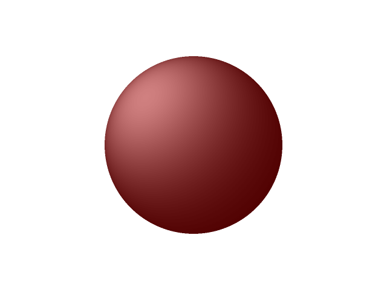

# raytracer-racket
Raytracing experiment with racket. Only std lib used.

This is a sister of this [raytracer in go](https://github.com/jasilven/raytracer).

Program produces image like this:



## run
```
 $ racket tracer.rkt 
Raytracing:
  cpu time: 8969 real time: 8969 gc time: 12
Antialiasing:
  cpu time: 3613 real time: 3614 gc time: 1
Writing image to out.png
(object:bitmap% ...)
```
Produces image file ```out.png``` in the current directory.
